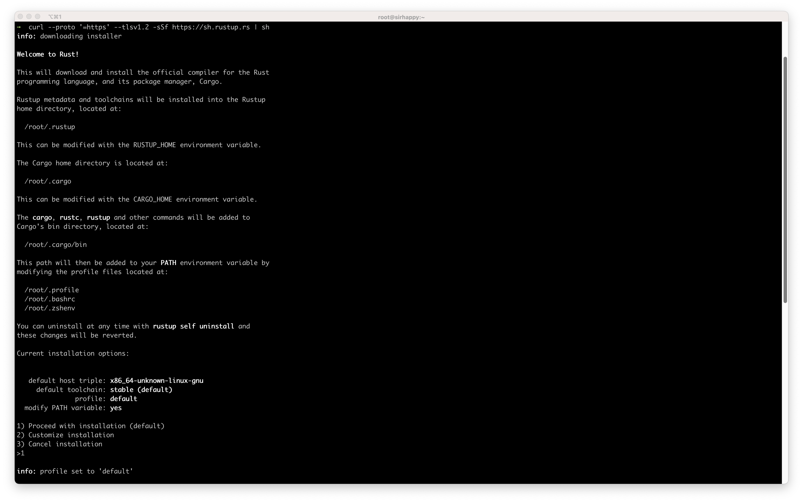
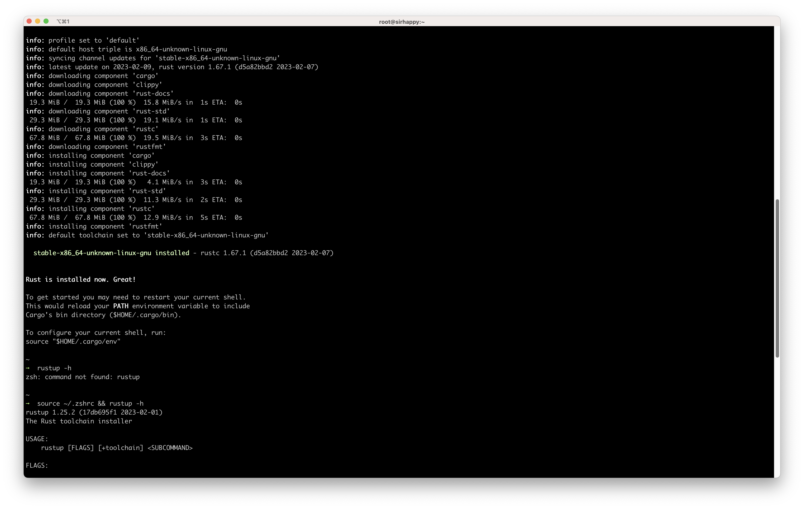
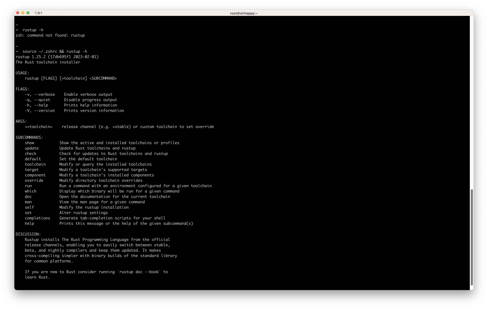
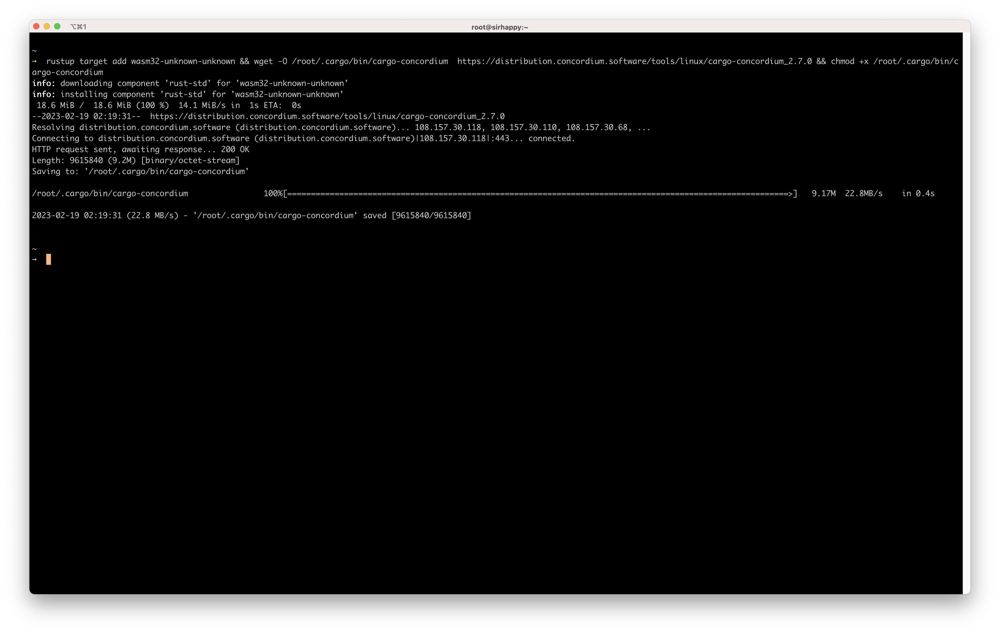
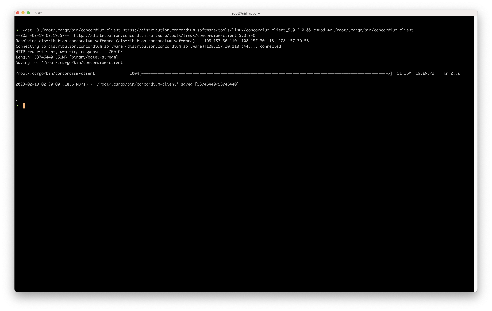
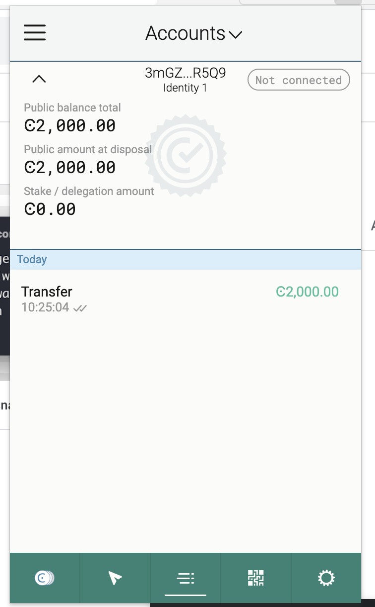
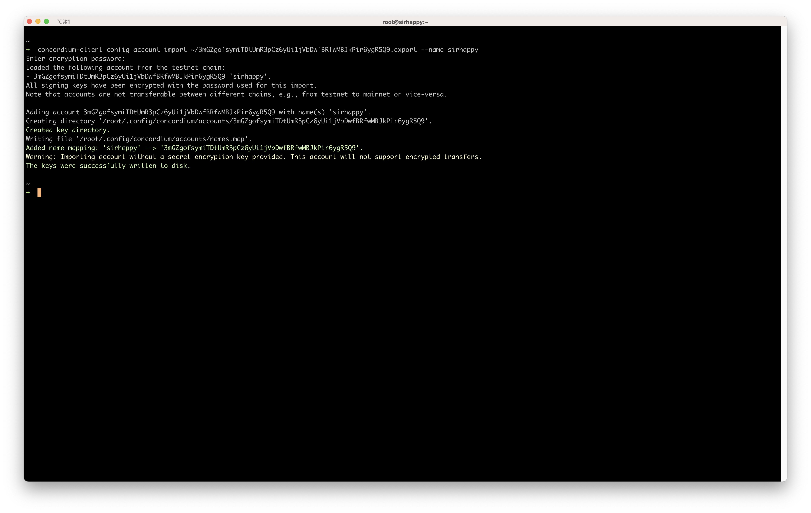

# Concordium-Task-1
TASK 1: Setup development environment
## Install Rust: 
Follow the instructions on the Rust website.

## Install cargo-concordium: 

## Install Concordium-client: 

## Create a Testnet account: 

## Export the account from the web wallet and import it into Concordium client: 

## Mainnet Address 
4nZMdvA9B6PAA43wHQqLSAbqP3TJ6QFzSyKXQHJLts6E7GY4cf
